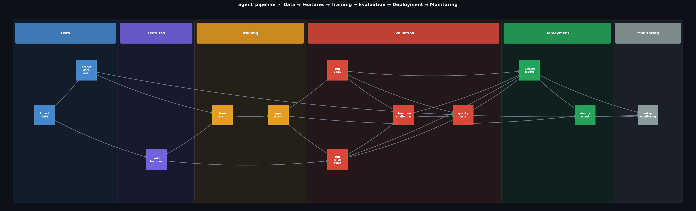

# agent-ops-demo

A multi-agent customer operations system built with **LangGraph** and **Claude Haiku**, paired with a full **ZenML CI/CD pipeline** that mirrors how production ML teams ship agents — with evals, a quality gate, canary deployment, and drift monitoring.

## Stack

| Layer | Technology |
|---|---|
| LLM | Claude Haiku (`claude-haiku-4-5-20251001`) via Anthropic API |
| Agent framework | [LangGraph](https://github.com/langchain-ai/langgraph) — StateGraph orchestration |
| Pipeline | [ZenML](https://zenml.io) — step-based ML pipeline with caching and artifact tracking |
| Evals | Custom eval suite (LLM-as-judge + deterministic checks) |
| Deployment | FastAPI server + canary traffic splitting |

---

## Project Structure

```
agent-ops-demo/
├── agent/
│   ├── customer_ops_agent.py   # Multi-agent graph (planner + 3 specialists + validator)
│   └── run_agent.py            # CLI: run sample queries interactively
│
├── evals/
│   └── eval_suite.py           # 4 evals: routing, memory, efficiency, quality
│
├── pipeline/
│   ├── agent_pipeline.py       # ZenML @pipeline definition (6 stages)
│   ├── run_pipeline.py         # Entry point: python pipeline/run_pipeline.py
│   └── steps/
│       ├── data.py             # ingest_data, detect_data_drift
│       ├── features.py         # build_features
│       ├── training.py         # tune_agent, ingest_agent
│       ├── evaluation.py       # run_evals, run_slice_evals, champion_challenger, quality_gate
│       ├── deployment.py       # register_model, deploy_agent
│       └── monitoring.py       # setup_monitoring
│
├── data/
│   ├── sample_queries.json          # 10 labelled test queries (4 categories)
│   └── baseline_distribution.json  # Category distribution baseline for drift detection
│
├── monitoring/                 # Generated after pipeline run
│   ├── config.json             # Thresholds, canary config, drift status
│   └── monitor.py              # Standalone monitor script
│
├── deployed/                   # Generated after pipeline run
│   ├── customer_ops_agent.py   # Copied agent
│   ├── server.py               # FastAPI server (auto-generated)
│   └── traffic_split.json      # Canary traffic config (10% → 50% → 100%)
│
├── model_registry.json         # Version history, champion pointer, eval scores
├── visualize_pipeline.py       # Generates pipeline_dag.png (matplotlib + networkx)
├── pipeline_dag.png            # Staged DAG visualization
├── requirements.txt
└── .env                        # ANTHROPIC_API_KEY (never commit)
```

---

## Setup

```bash
# 1. Clone the repo
git clone https://github.com/Abhisp/agent-ops-demo
cd agent-ops-demo

# 2. Create virtual environment
python3.11 -m venv .venv
source .venv/bin/activate   # Windows: .venv\Scripts\activate

# 3. Install dependencies
pip install -r requirements.txt

# 4. Add your Anthropic API key
echo "ANTHROPIC_API_KEY=sk-ant-..." > .env
```

---

## Running the Agent (standalone)

```bash
# 3 sample queries + interactive mode
python agent/run_agent.py

# All 10 sample queries + interactive mode
python agent/run_agent.py --all

# Interactive mode only
python agent/run_agent.py --interactive
```

Each response shows a metadata line with the routing decision:

```
[order_agent | confidence=0.9 | tools=['check_order_status']]

Agent: Your order ORD-002 is currently in transit...
```

---

## Agent Graph

```
START
  └─► planner
        ├─► refund_agent     ─┐
        ├─► order_agent      ─┼─► validator ─► END
        └─► escalation_agent ─┘
```

| Agent | Responsibility |
|---|---|
| **PlannerAgent** | Routes the query to the correct specialist |
| **RefundAgent** | Refund requests, returns, reimbursements |
| **OrderAgent** | Order status, tracking, delivery ETA |
| **EscalationAgent** | Complaints, angry customers, human handoff |
| **ValidatorAgent** | LLM-reviews the specialist response; rewrites if poor |

### Tools (all mock)

| Tool | Description |
|---|---|
| `check_order_status(order_id)` | Returns order status from a mock catalog |
| `process_refund(order_id, reason)` | Returns mock refund confirmation + ticket ID |
| `get_tracking_info(order_id)` | Returns carrier + tracking number |
| `escalate_to_human(customer_id, issue_summary)` | Creates a mock support ticket |

Sample order IDs: `ORD-001`, `ORD-002`, `ORD-003`

---

## ZenML Pipeline

The pipeline mirrors how large ML teams productionise models and agents — from raw data through to monitored canary deployment. Run it end-to-end with:

```bash
python pipeline/run_pipeline.py
```

ZenML initialises a local store on first run (`.zen/` directory). A dashboard is available at `http://127.0.0.1:8237` after `zenml up`.

### Pipeline Stages

```
Data → Features → Training → Evaluation → Deployment → Monitoring
```

#### Data
| Step | What it does |
|---|---|
| `ingest_data` | Loads `data/sample_queries.json`, validates schema, produces an 80/20 train/eval split |
| `detect_data_drift` | Compares the current category distribution to `data/baseline_distribution.json`; flags any category that has shifted by more than 15 percentage points |

#### Features
| Step | What it does |
|---|---|
| `build_features` | Extracts per-query features: keyword hits per routing category, `length_bucket` (short / medium / long), `has_order_id` flag, token estimate |

#### Training
| Step | What it does |
|---|---|
| `tune_agent` | For LLM agents "training" = config tuning: flags routing categories with low keyword coverage (<50%), selects the two shortest few-shot examples per category, and records drift warnings |
| `ingest_agent` | Validates the agent module loads cleanly, extracts the agent list, tool list, and entry point |

#### Evaluation
| Step | What it does |
|---|---|
| `run_evals` | Runs all 4 evals in `eval_suite.py` (see Eval Suite section below) |
| `run_slice_evals` | Breaks routing accuracy down by `length_bucket` and `has_order_id`; fails if any slice scores below 80% |
| `champion_challenger` | Loads the current champion's scores from `model_registry.json`; flags any metric that regresses by more than 2 percentage points |
| `quality_gate` | Raises `RuntimeError` (blocking deployment) if core evals, slice evals, or champion/challenger check fail |

#### Deployment
| Step | What it does |
|---|---|
| `register_model` | Appends this run to `model_registry.json` with auto-incremented semver; sets the champion pointer if the quality gate passed |
| `deploy_agent` | Copies agent files to `deployed/`, writes `traffic_split.json` with 10% canary config, generates and starts a FastAPI server |

#### Monitoring
| Step | What it does |
|---|---|
| `setup_monitoring` | Writes `monitoring/config.json` (alert thresholds, canary promotion stages) and generates `monitoring/monitor.py` — a standalone script that reads `agent_runs.jsonl` and alerts on routing anomalies, cost spikes, memory bleed, quality regressions, and canary error rate |

### Canary Deployment

The agent deploys at **10% traffic** on first release. Promotion stages are `10% → 50% → 100%`, requiring 30 minutes of healthy metrics at each stage before auto-promotion. Breaching any threshold triggers auto-rollback.

```json
// deployed/traffic_split.json
{
  "canary_percent": 10,
  "stable_percent": 90,
  "promotion_stages": [10, 50, 100],
  "rollback_on": { "max_error_rate": 0.05, "max_latency_p99_ms": 2000 }
}
```

### Running the Monitor

After a pipeline run, check agent health with:

```bash
python monitoring/monitor.py
```

Append agent run results as JSON lines to `monitoring/agent_runs.jsonl` to enable live alerting.

### Visualising the Pipeline DAG

ZenML's dashboard shows individual step nodes. For a staged lane view:

```bash
python visualize_pipeline.py   # generates pipeline_dag.png
open pipeline_dag.png
```



---

## Eval Suite

`evals/eval_suite.py` contains four evals, each designed to catch one of the original bugs:

| Eval | Threshold | What it catches |
|---|---|---|
| **Routing Correctness** | Worst category ≥ 90% | Misrouting bugs in `planner_agent` |
| **Memory Isolation** | 100% — zero bleed | Cross-session state leak in `_GLOBAL_MEMORY` |
| **LLM Call Efficiency** | ≥ 80% queries within 4 calls | Retry loop in `order_agent` |
| **Response Quality** | Average score ≥ 7.0 / 10 | Silent pass-through in `validator_agent` |

Run evals standalone:

```bash
PYTHONPATH=agent:evals .venv/bin/python evals/eval_suite.py
```

---

## Bugs (all fixed)

Four bugs were deliberately planted for debugging exercises. Each was marked `# BUG N:` in the source.

| # | Type | Root cause | Fix |
|---|---|---|---|
| 1 | Routing | `planner_agent` routed `"where"` queries to `refund_agent` ~30% of the time via a random branch | Removed random branch; routing is now fully deterministic with escalation checked first |
| 2 | Memory leak | `_GLOBAL_MEMORY` was written at module scope without `session_id` namespacing — prior customer context bled into new sessions | Writes are now keyed under `session_id`; top-level keys never leak between sessions |
| 3 | Retry loop | `order_agent` ran up to 5 LLM calls for ambiguous queries with no early exit | Removed retry loop; single LLM call regardless of query type |
| 4 | Silent validator | `validator_agent` hardcoded `quality_ok = True` and never called the LLM | Validator now calls the LLM to review the response and rewrites it if the review returns `IMPROVE` |
